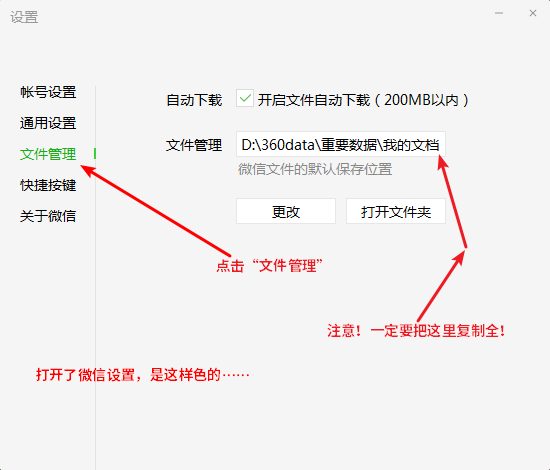
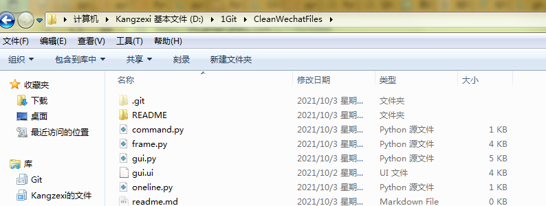
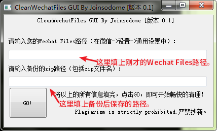
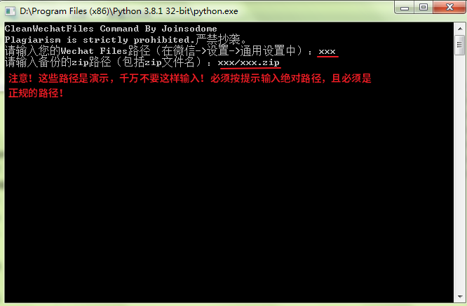

# CleanWechatFiles简介

`CleanWechatFiles` 是`Joinsodome`制作的清理`Wechat Files`的文件。它会删掉`Backup`、`BackupFiles`、`ResUpdateV2`等无用的文件，并将所有资料压缩成`zip`文件。

为了便于开发，本软件暂时不封装`EXE`版本，因此你也可以Fork我的项目，对它进行更细致的更改。

`CleanWechatFiles`只适用于Windows版本，因为我不知道其他系统的`Wechat Files`目录树是否不一样。

## 1.前期准备

环境使用`Python 3.8及以上`就可以啦，具体环境配置可以看[这里](https://zhuanlan.zhihu.com/p/397995206)。

在使用时，你需要查看你的Wechat Files。你可以点击微信的`更多->设置`打开微信设置，然后……

最后，将所有代码下载到本地。整个目录应该如下（不代表最终目录树）：

点击<kbd>SHIFT+RM</kbd>，选择`在此处打开命令窗口`，输入`pip install -r requirements.txt`，如果结尾出现`Sucessfully installed 'xxx'`，那么即可开始使用。

## 2.几个版本

你可以直接调用`frame.py`文件，但是你可以使用以下几个版本：

### 2.1.GUI版本

点击<kbd>SHIFT+RM</kbd>，选择`在此处打开命令窗口`。输入`python frame.py`进行校验，如果没有任何输出，即可开始使用（校验只需一次）。

继续输入`python gui.py`，你将看到（UI可能会改变，且页面不代表最终页面）：

填完后，点击`GO!`，即可开始清理。

### 2.2.Oneline版本

点击<kbd>SHIFT+RM</kbd>，选择`在此处打开命令窗口`。输入`python frame.py`进行校验，如果没有任何输出，即可开始使用（校验只需一次）。

继续输入`python oneline.py -dp %Wechat Files的路径% -zp %备份后保存的路径%`并点击<kbd>Enter</kbd>，即可开始清理。

### 2.3.Command版本

点击<kbd>SHIFT+RM</kbd>，选择`在此处打开命令窗口`。输入`python frame.py`进行校验，如果没有任何输出，即可开始使用（校验只需一次）。

继续输入`python command.py`，你将看到（UI可能会改变，且页面不代表最终页面）：

点击<kbd>Enter</kbd>，即可开始清理。

## 3.Q&A

Q:为什么出现`ValueError:The above two inputs cannot be enpty.以上两个输入框不可为空。`、`（弹窗）两个输入框不准为空！`或`ValueError:-dp or -zp Cannot be enpty.-dp或-zp不可为空。`？

A:必须按照官方的输入格式！

---

Q:为什么出现了`（弹窗）发生不可抗拒错误，具体情况可看日志！`或`RuntimeErroor:An irresistible error occurred.发生不可抗拒错误。错误原因：xxx`?

A:你可以直接截图，直接发送Issues给我，我会排查错误。

***

***

联系方式：kangzexi@yeah.net，欢迎吐槽！

